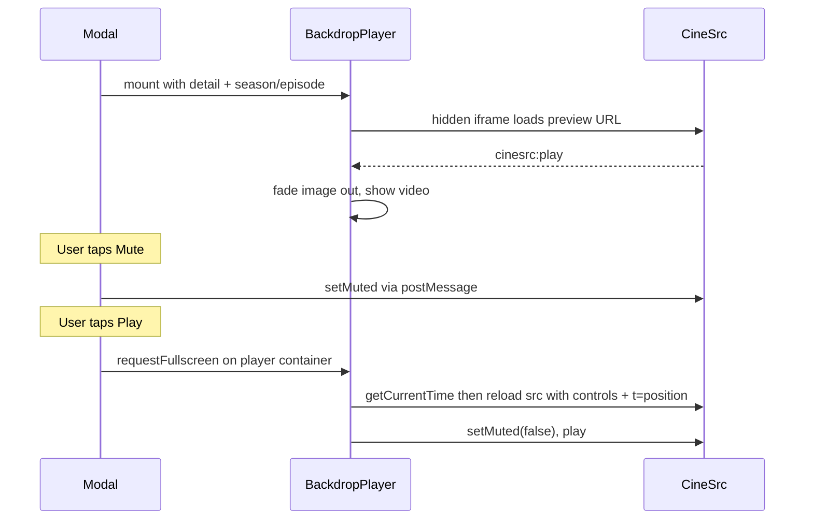

# Discover Rows & Media Detail Modal Overhaul

## 1. Discover page row reorder

**File:** [`Web/components/streamn/discover-app.tsx`](Web/components/streamn/discover-app.tsx)

Add a shared constant to avoid duplication:

```ts
const PROVIDER_SLUGS = ["netflix", "prime", "disney", "max", "hulu"] as const;
```

Helper to render provider rows for a media type:

```ts
function renderProviderRows(mediaLabel: "Movies" | "Series", mediaType: "movie" | "tv", startIndex: number)
```

### Home tab (`renderHomeRows`)
Keep **Continue Watching** and **My List** at the top (per your preference), then:

**Movies block**
1. Top 10 Movies Today (`trendingMoviesToday.slice(0, 10)`, wide + trending)
2. Top Rated Movies
3. Movies on Netflix / Prime / Disney+ / Max (HBO) / Hulu — one `LazyProviderRow` per slug

**Series block**
4. Top 10 Series Today
5. Top Rated Series
6. Series on Netflix / Prime / Disney+ / Max / Hulu

Remove the current interleaved Netflix-movies-then-Netflix-series pattern and the trailing duplicate top-rated rows.

### Movies tab (`renderMoviesRows`)
Replace current rows (Trending This Week, Latest Movies, partial providers) with:
1. Top 10 Movies Today
2. Top Rated Movies
3. All five provider movie rows

### Shows tab (`renderShowsRows`)
Same pattern for series:
1. Top 10 Series Today
2. Top Rated Series
3. All five provider series rows

Provider slugs already exist in [`Web/lib/tmdb.ts`](Web/lib/tmdb.ts) (`max` = HBO/Max). No backend changes needed — [`LazyProviderRow`](Web/components/streamn/discover-app.tsx) already filters by `mediaType`.

---

## 2. Media detail modal — content restructure

**File:** [`Web/components/streamn/media-detail-content.tsx`](Web/components/streamn/media-detail-content.tsx)

### Remove hero badges
Delete the `detail-pill` row (rating, year, runtime, certification, genres) from the hero section.

### Move stats into description section
Below the overview paragraph, add a single subtle metadata line:

```tsx
<p className="text-xs text-white/40">
  {voteAverage}/10 · {year} · {runtime} · {certification} · {genres.join(", ")}
</p>
```

Only include segments that have values (skip empty runtime/certification). Use `text-xs text-white/40` — no pill borders.

### Inline cast text (replace carousel)
Remove the Cast section with profile images. Directly under the stats line:

```tsx
<p className="mt-2 text-xs">
  <span className="text-white">cast: </span>
  <span className="text-white/40">{detail.cast.map(c => c.name).join(", ")}</span>
</p>
```

---

## 3. Action buttons — icon-only, thumbs up, mute

**Files:** [`media-detail-content.tsx`](Web/components/streamn/media-detail-content.tsx), [`watchlist-picker.tsx`](Web/components/streamn/watchlist-picker.tsx), [`globals.css`](Web/app/globals.css)

### Button row layout
```
[ Play ] [ 👍 ] [ + ] [ 🎬 ] ············· [ 🔇/🔊 ]
```

- **Play** — keeps label (primary CTA)
- **Like** — swap `Heart` for `ThumbsUp`; remove "Like"/"Liked" text; when liked, use a filled solid style (white background + black icon, mirroring primary button) instead of the current subtle red tint
- **Watchlist** — add `iconOnly?: boolean` prop to `WatchlistPicker`; hide "Watchlist" label when true
- **Trailer** — icon only (`Film`), keep `aria-label="Trailer"`
- **Mute** — new icon button at far right (`ml-auto` on a flex row); toggles preview player mute via CineSrc `setMuted` command

Add `.icon-button` CSS (3rem square/circle, equal padding, no horizontal text padding) alongside existing `.primary-button` / `.ghost-button`.

---

## 4. Fix watchlist dropdown clipping

**Root cause:** Hero section uses `overflow-hidden`, which clips the absolutely positioned `.watchlist-picker-menu` below the button.

```184:184:Web/components/streamn/media-detail-content.tsx
      <section className='relative min-h-[58vh] overflow-hidden'>
```

**Fix:** Restructure hero into layers:
- **Backdrop layer** (`absolute inset-0 overflow-hidden`) — image and/or preview iframe only
- **Gradient overlays** — same layer
- **Content layer** (`relative z-10`, no `overflow-hidden`) — title, buttons, dropdown can overflow freely

Optionally add `overflow-visible` on the action-button flex row for extra safety.

---

## 5. Backdrop video preview + fullscreen play

**New file:** `Web/components/streamn/detail-backdrop-player.tsx`  
**Extend:** [`Web/lib/media.ts`](Web/lib/media.ts) — add `cinesrcPreviewUrl(...)` helper

### CineSrc integration (from [cinesrc.st/docs](https://cinesrc.st/docs))

| Event / command | Use |
|---|---|
| `cinesrc:play` | Trigger fade from backdrop image → live video |
| `cinesrc:ready` | Player loaded (optional loading state) |
| `cinesrc:timeupdate` | Track `currentTime` for seamless fullscreen handoff |
| `setMuted(muted)` | Mute button control |
| `getCurrentTime` | Read position before fullscreen reload (via `cinesrc:response`) |

Preview embed URL params: `autoplay=true`, `muted=true`, `controls=false`, plus resume `t=` from saved watch progress (same logic as [`watchHref`](Web/lib/streamn-storage.ts) / [`WatchPlayer`](Web/components/streamn/watch-player.tsx)).

Extract a small shared utility `Web/lib/cinesrc-messages.ts`:
- `sendCinesrcCommand(iframe, command, args)`
- `useCinesrcMessages(iframeRef, handlers)` — origin-checked listener

### Component behavior



1. **Mount:** Hidden/offscreen iframe preloads behind backdrop image (opacity 0, pointer-events none until playing).
2. **On `cinesrc:play`:** Crossfade backdrop `Image` out, iframe in (keep gradient overlays for text legibility).
3. **Mute button:** Toggles mute on preview iframe; state synced via `cinesrc:volumechange` if available.
4. **Play button:** Change from `<Link href={href}>` to a button that:
   - Gets current playback time from the preview iframe
   - Requests **Fullscreen API** on the player container (`detail-backdrop-player` wrapper ref)
   - Reloads iframe src to full watch URL (default controls, `continueprompt=false`, `t=currentTime`) so controls appear in fullscreen — brief reload but continuous playback position
   - Sends `play` + `setMuted(false)` after reload
5. **Cleanup:** Remove iframe / pause on modal close (`detail` unmount).

For TV shows, use the same season/episode resolution already in `MediaDetailContent` (saved progress → first episode).

---

## 6. Episode list — load 8 more at a time

**File:** [`media-detail-content.tsx`](Web/components/streamn/media-detail-content.tsx) — `Episodes` component

The API already returns all episodes for a season ([`getSeasonEpisodes`](Web/lib/tmdb.ts)); the UI hard-caps at 8:

```91:91:Web/components/streamn/media-detail-content.tsx
        {episodes.slice(0, 8).map((episode) => (
```

Changes:
- Add `visibleCount` state (default `8`)
- Render `episodes.slice(0, visibleCount)`
- Reset `visibleCount` to `8` when season changes
- If `episodes.length > visibleCount`, show a "Load 8 more" button below the list (or "Load more" showing remaining count)

No API changes required.

---

## Files touched (summary)

| File | Change |
|---|---|
| `discover-app.tsx` | Row reorder + provider helper |
| `media-detail-content.tsx` | Hero restructure, stats/cast, buttons, episode pagination |
| `detail-backdrop-player.tsx` | **New** — CineSrc preview + fullscreen |
| `cinesrc-messages.ts` | **New** — shared postMessage helpers |
| `media.ts` | `cinesrcPreviewUrl` helper |
| `watchlist-picker.tsx` | `iconOnly` prop |
| `globals.css` | `.icon-button`, `.like-button-active` filled style, optional dropdown z-index tweak |

No changes to [`discover/page.tsx`](Web/app/discover/page.tsx) data fetching — all required provider slugs and datasets are already available.
